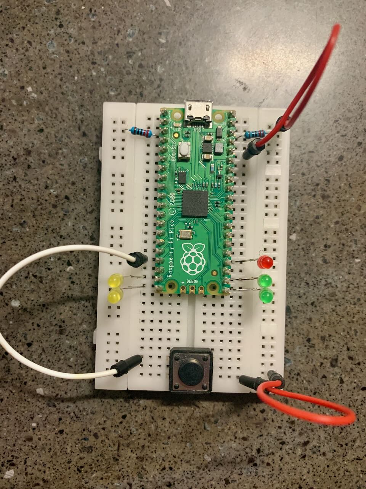

# Morse Converter
A utility for the raspberry pi pico that allows for conversion of text to morse and vice versa

### Button Mode

With serial monitor connected, press the button once to activate button mode, then encode your words by pressing a button for a dot and holding for a dash, then release until 1 yellow light turns on to finish a letter. Release the button until 2 yellow lights turn on to finish a word. To finish the message hold the button until the red light turns on.

[Button Mode Example](assets/videos/button%20mode.mp4)

### Serial Mode
With serial monitor connected, hold button until you receive serial mode prompt. Then type your message into the serial monitor finishing with a return.

[Serial Mode Example](assets/videos/serial%20mode.mp4)
## Pin-out
- 🔴 Gpio 18
- 🟡 Gpio 17
- 🟡 Gpio 16
- 🟢 Gpio 15
- 🟢 Gpio 14
- 🔘 Gpio 13


  

## Compiling
To compile the program, the thumbv6m-none-eabi toolchain is required
```shell
rustup target add thumbv6m-none-eabi
```
To convert the ELF into a UF2 file, elf2uf2-rs is required
```shell
cargo install elf2uf2-rs
```
Once these are installed, plug the pico in while holding the BOOTSEL button and run `cargo run`

To get the executable instead, run `cargo build` then `elf2uf2-rs target/thumbv6m-none-eabi/debug/morse_code` 